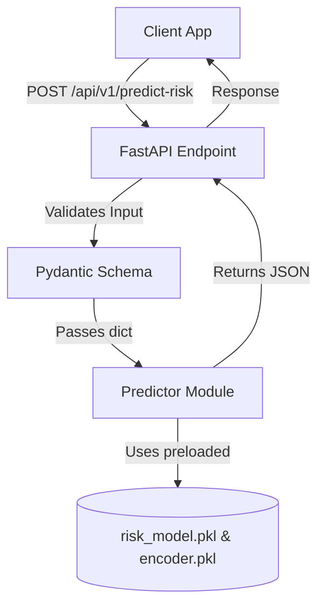

# SentinelAI: Backend Integration Guide

This guide describes how to integrate the trained Machine Learning models from the `ml/` directory into a Python-based backend (e.g., **FastAPI**).

---

## 1. Prerequisites

Ensure you have the required dependencies installed in the backend environment:
```bash
pip install fastapi uvicorn pandas joblib scikit-learn
```

---

## 2. Integration Architecture

To avoid reloading the model and encoder on every API request, load them into memory once when the backend application starts.



---

## 3. Creating the FastAPI Integration

Create a new file (e.g. `main.py` in your backend project folder) with the following implementation:

```python
import os
import sys
from fastapi import FastAPI, HTTPException
from pydantic import BaseModel, Field
import joblib
import pandas as pd

# Add the ml directory to the system path to import predict_risk if needed,
# or define the prediction function locally as shown below.
ML_DIR = os.path.abspath(os.path.join(os.path.dirname(__file__), "ml"))
MODEL_PATH = os.path.join(ML_DIR, "models", "risk_model.pkl")
ENCODER_PATH = os.path.join(ML_DIR, "models", "encoder.pkl")

# Initialize FastAPI App
app = FastAPI(
    title="SentinelAI Security Engine",
    description="AI-Powered Privileged Access Misuse & Insider Threat Detection API",
    version="1.0.0"
)

# Load ML Model and Encoder globally on startup
if not os.path.exists(MODEL_PATH) or not os.path.exists(ENCODER_PATH):
    raise FileNotFoundError(
        f"Model files not found. Ensure they exist at {ML_DIR}/models/"
    )

model = joblib.load(MODEL_PATH)
encoder = joblib.load(ENCODER_PATH)

# -----------------------------------------------
# Request Schema
# -----------------------------------------------
class UserActivityInput(BaseModel):
    login_hour: int = Field(..., ge=0, le=23, description="Hour of login (0-23)")
    new_device: int = Field(..., ge=0, le=1, description="1 if login is from a new device, else 0")
    new_location: int = Field(..., ge=0, le=1, description="1 if login is from a new location, else 0")
    failed_logins: int = Field(..., ge=0, description="Number of failed login attempts")
    files_downloaded: int = Field(..., ge=0, description="Number of files downloaded during the session")
    commands_executed: int = Field(..., ge=0, description="Number of sensitive commands executed")
    session_duration: int = Field(..., ge=0, description="Session duration in minutes")
    weekend_login: int = Field(..., ge=0, le=1, description="1 if login occurred on a weekend, else 0")

    class Config:
        schema_extra = {
            "example": {
                "login_hour": 2,
                "new_device": 1,
                "new_location": 1,
                "failed_logins": 5,
                "files_downloaded": 3500,
                "commands_executed": 45,
                "session_duration": 200,
                "weekend_login": 1
            }
        }

# -----------------------------------------------
# Endpoint
# -----------------------------------------------
@app.post("/api/v1/predict-risk")
def predict_risk_endpoint(activity: UserActivityInput):
    try:
        # Convert Pydantic model to dict
        data = activity.dict()

        # Convert to pandas DataFrame
        df = pd.DataFrame([data])
        
        # Enforce the correct feature names ordering (expected by scikit-learn)
        df = df[model.feature_names_in_]

        # Get raw prediction index
        prediction = model.predict(df)

        # Inverse transform to get string label
        risk = encoder.inverse_transform(prediction)[0]

        # Calculate optional risk score
        risk_scores = {
            "Low": 25,
            "Medium": 60,
            "High": 90
        }

        # Determine explainable reasons
        reasons = []
        if data["new_device"]:
            reasons.append("Login from a new device")
        if data["new_location"]:
            reasons.append("Login from a new location")
        if data["failed_logins"] >= 3:
            reasons.append("Multiple failed login attempts")
        if data["files_downloaded"] > 1000:
            reasons.append("Large number of downloaded files")
        if data["login_hour"] < 5:
            reasons.append("Login during unusual hours")
        if data["weekend_login"]:
            reasons.append("Weekend login detected")

        return {
            "risk": risk,
            "risk_score": risk_scores.get(risk, 25),
            "reasons": reasons
        }

    except Exception as e:
        raise HTTPException(status_code=500, detail=str(e))

# Health Check Endpoint
@app.get("/health")
def health():
    return {"status": "healthy", "model_loaded": True}
```

---

## 4. Running the Backend Server

Start the server using `uvicorn`:
```bash
uvicorn main:app --reload
```

This starts the server on `http://127.0.0.1:8000`. You can access the interactive Swagger API documentation at:
- `http://127.0.0.1:8000/docs`

---

## 5. Testing the API

You can test the endpoint using `curl`:
```bash
curl -X POST "http://127.0.0.1:8000/api/v1/predict-risk" \
     -H "Content-Type: application/json" \
     -d '{
       "login_hour": 2,
       "new_device": 1,
       "new_location": 1,
       "failed_logins": 5,
       "files_downloaded": 3500,
       "commands_executed": 45,
       "session_duration": 200,
       "weekend_login": 1
     }'
```

Response:
```json
{
  "risk": "High",
  "risk_score": 90,
  "reasons": [
    "Login from a new device",
    "Login from a new location",
    "Multiple failed login attempts",
    "Large number of downloaded files",
    "Login during unusual hours",
    "Weekend login detected"
  ]
}
```
